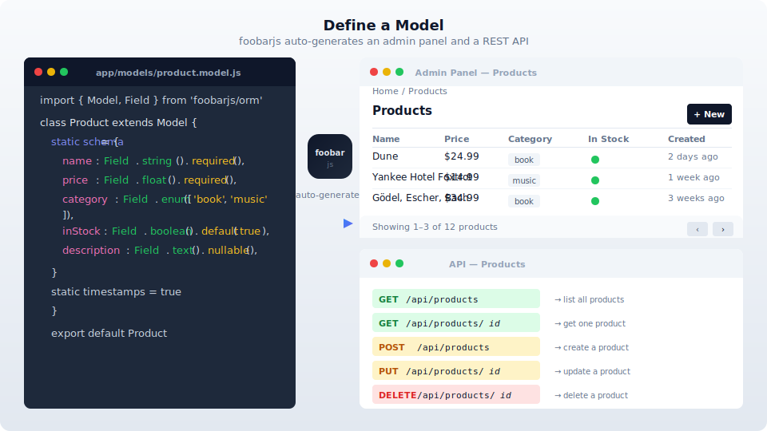

# foobarjs documentation

> **Experimental — not production ready.** foobarjs is under active development (v0.9.0). APIs, conventions, and database schemas may change between releases without a migration path. Use it for prototyping, learning, and side projects. Do not deploy to production yet.

Documentation for the [foobarjs](https://github.com/foobarjs/foobarjs)
framework — a batteries-included Node.js MVC framework.

> 👋 **New here?** Start with the **[30-minute tutorial](./tutorial.md)** —
> scaffold an app, add a model, and see the auto-admin + auto-API light up.
> Come back to the reference when you want to look something up.

---

## Philosophy

foobarjs is opinionated so you can focus on building.

- **Batteries included.** ORM, auth, admin panel, auto-generated REST API,
  queues, cache, mail, storage, realtime, notifications, validation, views
  — all in one npm package. No plugin archaeology.
- **Conventions over configuration.** File in the right folder, named the
  right way, gets picked up. Controllers, models, admin resources,
  listeners, jobs, and validators all auto-discover.
- **Zero build step.** Strict ESM, Node 20+, no bundler, no `dist/`
  directory. Source is what's on disk — JSX/TSX views are transformed
  on-import by esbuild via a Node module loader hook.
- **One package on npm.** Install `foobarjs`. Sub-paths (`foobarjs/orm`,
  `foobarjs/auth`, ...) are subpath exports of the same package.
- **Escape hatches everywhere.** `foobar.app` exposes the underlying HTTP
  router. `Model.query().getQueryBuilder()` gives you the raw query
  builder. `this.c` is the request context. When the framework's opinion
  doesn't fit, drop down one layer.

---

## 🚀 Start here

Walkthroughs and setup for someone new to the framework.

- **[Tutorial: build a foobarjs app in 30 minutes](./tutorial.md)** — recommended first read
- [Installation](./installation.md) — Node 20+, `foobar new`, environment
- [Directory structure](./directory-structure.md) — where each thing lives
- [Conventions](./conventions.md) — the naming rules that make auto-discovery work
- [Configuration](./configuration.md) — `config/*.js` and env
- [CLI](./cli.md) — every `foobar` command

## 🛠 How-to guides

Task-oriented recipes — "how do I…" answered in one focused page each.

- [Recipes](./recipes.md) — the current mixed-bag; being reorganized as Q&A
- [Troubleshooting](./troubleshooting.md) — common errors, first-time gotchas

## 📖 Reference

Look up what a subsystem does and how to call it.

**HTTP**
- [Routing](./routing.md) · [Controllers](./controllers.md) · [Views](./views.md)
- [Session](./session.md) · [Error handling](./error-handling.md) · [Logging](./logging.md)
- [Middleware](./middleware.md) · [Security](./security.md)

**Data**
- [ORM query reference](./orm/getting-started.md) · [Relationships](./orm/relationships.md) · [MongoDB support](./orm/mongo.md)
- [Migrations](./database/migrations.md) · [Seeding](./database/seeding.md)
- [Validation](./validation.md) · [Serialization](./serialization.md)

**Auth**
- [Authentication](./authentication.md) · [Authorization](./authorization.md)

**Admin & API**
- [Admin panel](./admin-panel.md) · [API](./api.md) · [Helpers](./helpers.md)

**Async & I/O**
- [Queues](./queues.md) · [Cache](./cache.md) · [Redis](./redis.md)
- [Events](./events.md) · [Realtime](./realtime.md)
- [Mail](./mail.md) · [Notifications](./notifications.md) · [Storage](./storage.md)

**Testing**
- [Testing](./testing.md)

## 💡 Explanation

Design context — why the framework is shaped the way it is. Read these when
something surprises you or when you want a mental model before diving in.

- [Lifecycle](./lifecycle.md) — how a request flows from boot to response
- [AGENTS.md](./AGENTS.md) — architecture notes for contributors and agents
- [Auth model](./explanations/auth-model.md) — two concepts, one vocabulary
- [Database workflow](./database/workflow.md) — the two schema-sync modes, safety guarantees, multi-team story

---

## Related

- Framework source: [foobarjs/foobarjs](https://github.com/foobarjs/foobarjs)
- Reference application: [foobarjs/demo](https://github.com/foobarjs/demo) — a full event platform exercising every subsystem

## License

Documentation is licensed under [CC BY 4.0](./LICENSE).
